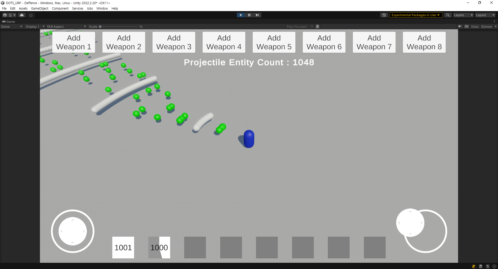
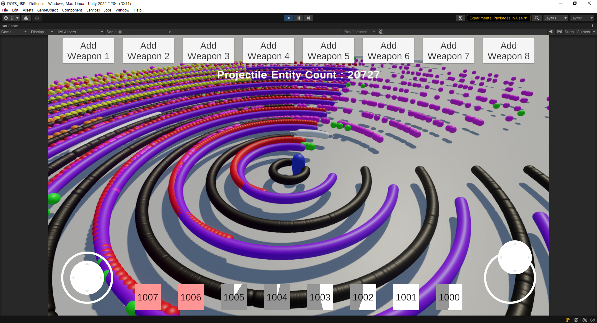
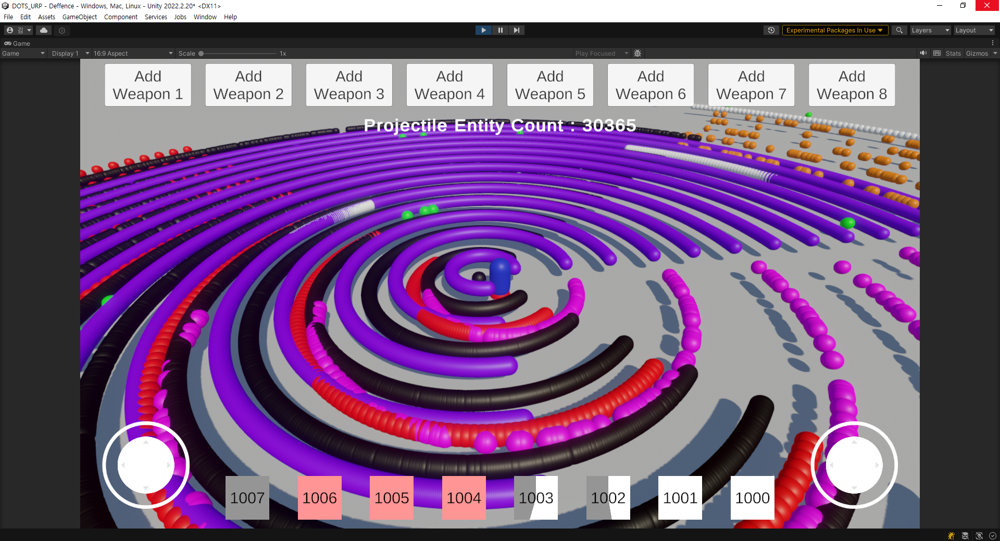

# DOTS
> ECS의 다양한 기능의 학습 및 테스트를 목적으로 진행중인 프로젝트.

* `Projectile`을 `Entity`로 구성하여 `System`으로 스폰.
* 많은 양의 `Projectile`의 빠른 생성을 목표로 제작.

> ## 참고 자료
* [EntityCommandSystemSample](https://github.com/Unity-Technologies/EntityComponentSystemSamples)

> 이미지

